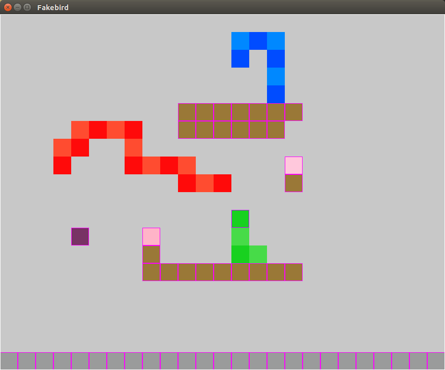

Fakebird
========

A clone of the game "Snakebird" programmed from scratch including software rendering. I also made a  perspecive correct triangle software rasterizer.

## Features

* Live c++ code editing
  - program is split into a platform layer (main) and a game layer (.so). The game code can be recompiled and dynamically loaded while the platform layer is running.
  - Makes iteration on logic and graphical effects really seamless.
* Program recording
  - program records game state every so often and saves all your inputs into a circular buffer.
  - Playback since last memory save can be looped by pressing p
  - This coupled with live code editing creates incredible possibility for live game logic or graphical debugging. After spotting a bug during runtime you can hit p and the game will loop, then you can edit the code live.
* Tile editor based DCC
  - The game has 2 in game editors. One for gameplay logic and one for layerd graphical tiles.
* Essential snakebird gameplay features
  - This clone has most features found in the puzzle game Snakebird, up to and including teleportation. 
* Overworld
  - The game has a level selection screen (here called overworld)
  - New levels can be created by junping into the editor and saved by pressing ctrl+s

## Some Screenshots

### Gameplay 
* The cube in the background is software rasterized

### Game Logic Editor

### Tile Editor

## Textured Triangle Rasterizer
The project also includes a triangle with perspective correct texture mapping (right)

* The rasterization code is from Fabien Giesens blog
* Perspective correct texture mapping was achieved with the help an article by Chris Hecker on the topic (Right has perspective correction applied)

